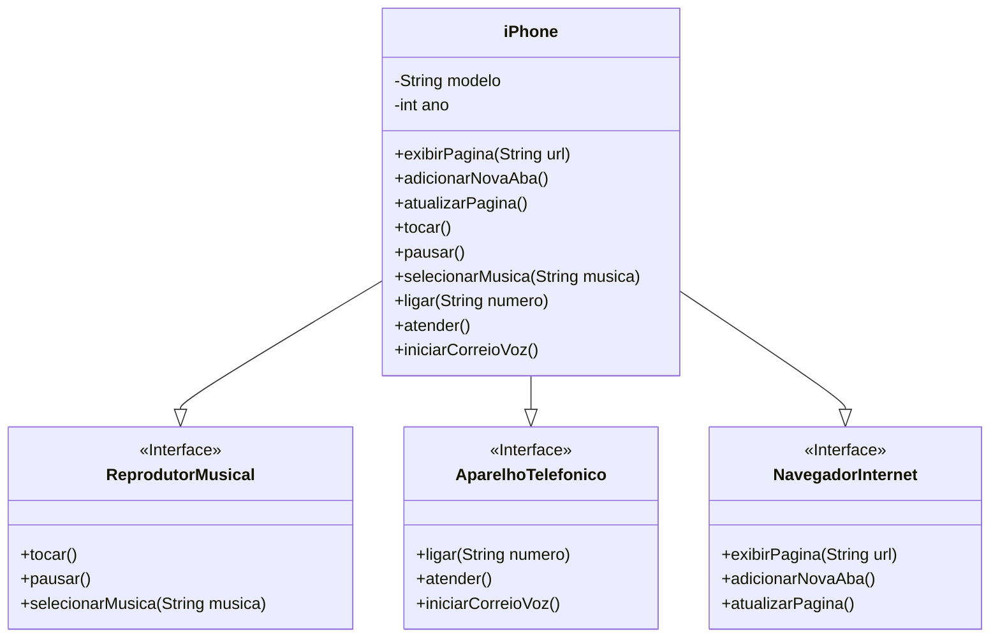

# POOdesafioDio

### Diagrama UML (Mermaid)

```mermaid
classDiagram
    class iPhone {
        -String modelo
        -int ano
        +exibirPagina(String url)
        +adicionarNovaAba()
        +atualizarPagina()
        +tocar()
        +pausar()
        +selecionarMusica(String musica)
        +ligar(String numero)
        +atender()
        +iniciarCorreioVoz()
    }
    
    class ReprodutorMusical {
        <<Interface>>
        +tocar()
        +pausar()
        +selecionarMusica(String musica)
    }
    
    class AparelhoTelefonico {
        <<Interface>>
        +ligar(String numero)
        +atender()
        +iniciarCorreioVoz()
    }
    
    class NavegadorInternet {
        <<Interface>>
        +exibirPagina(String url)
        +adicionarNovaAba()
        +atualizarPagina()
    }
    
    iPhone --|> ReprodutorMusical
    iPhone --|> AparelhoTelefonico
    iPhone --|> NavegadorInternet
```
